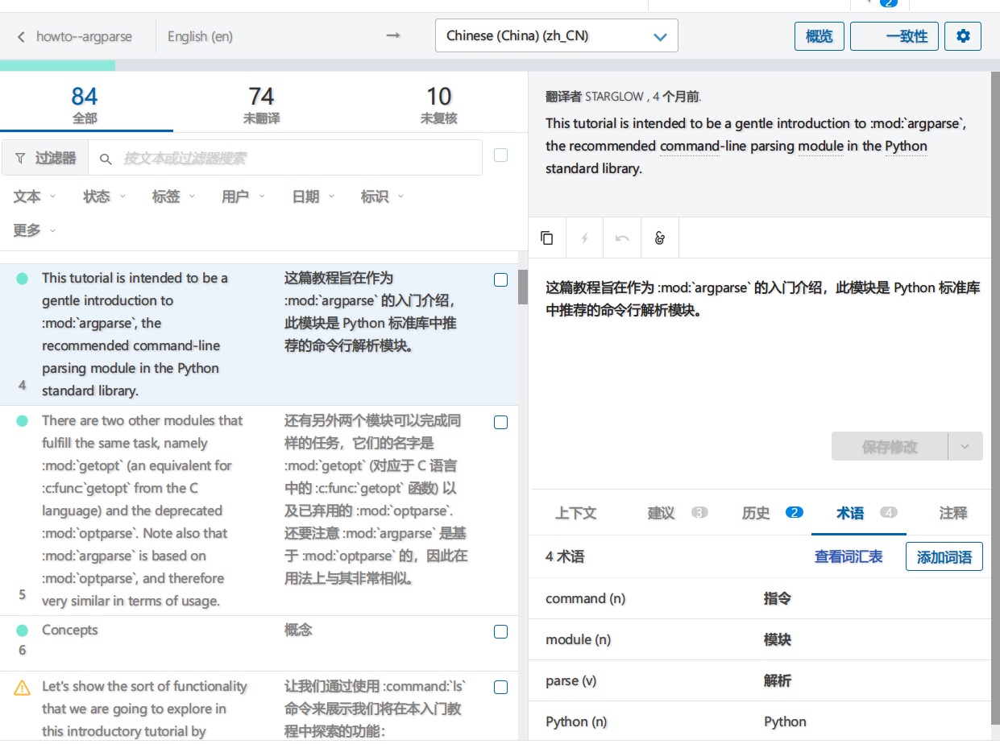

今天看到这个帖子[别开心太早， Python 官方文档的翻译差远了 - V2EX](https://www.v2ex.com/t/550164) 发现参与 python 文档翻译的门槛还挺低的，就尝试了一下翻译了两段文档.

## 参与翻译的方法

<!-- more -->

按照 [pep-545](https://www.python.org/dev/peps/pep-0545/)的说法, 有三步需要做:

1. 注册一个 <https://bugs.python.org> 的账号, 这个用户名在签 license 的时候会用到.
2. 签 license [介绍](https://www.python.org/psf/contrib/) 具体签署是在[这个页面上](https://www.python.org/psf/contrib/contrib-form/) 用的 adobe sign, 填完那个 iframe 里面的几个框就能提交了.
3. 注册 transifex, 选择自己的语言, 并且[申请加入](https://www.transifex.com/python-doc/python-newest/)

然后等待被允许加入团队, 然后就可以开始翻译了.

翻译是以每段为单位进行的

[python/python-docs-zh-cn: zh_CN translation of the Python documentation](https://github.com/python/python-docs-zh-cn)

中文的 po 文件在这个仓库里, 每个小时会有一个 bot 会自动把 transifex 上面的翻译同步到仓库里面去, 但是自己的名字并不会出现在这个仓库的 contributors 里面, 233
